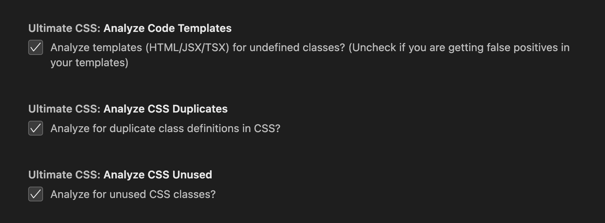
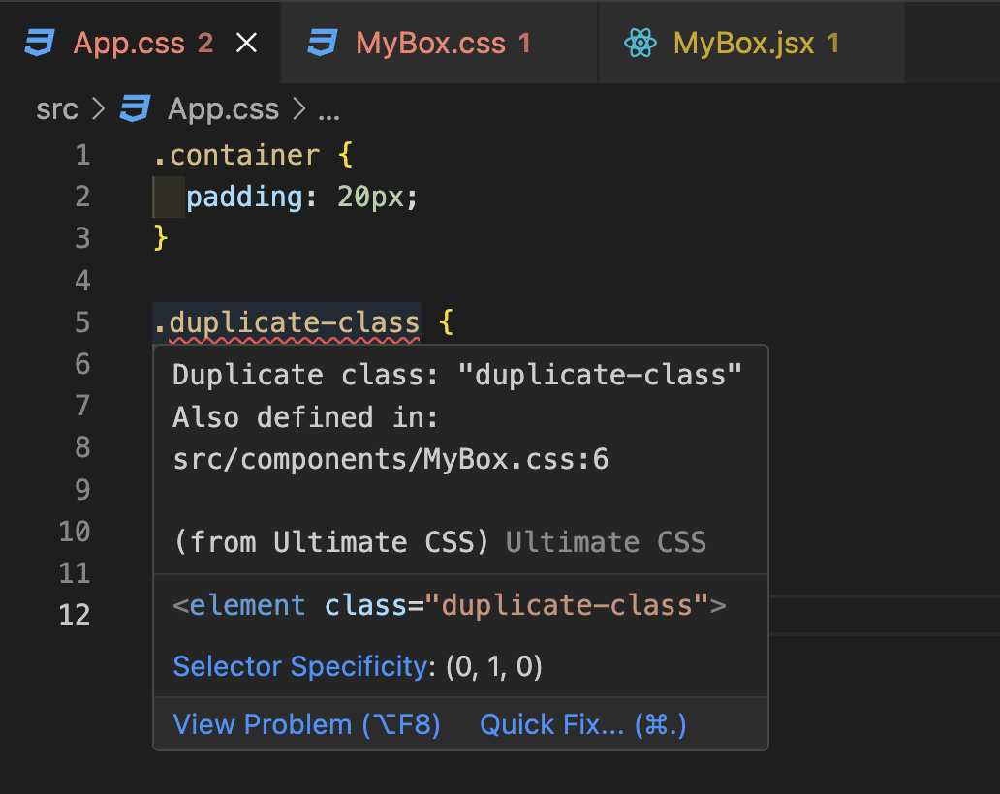
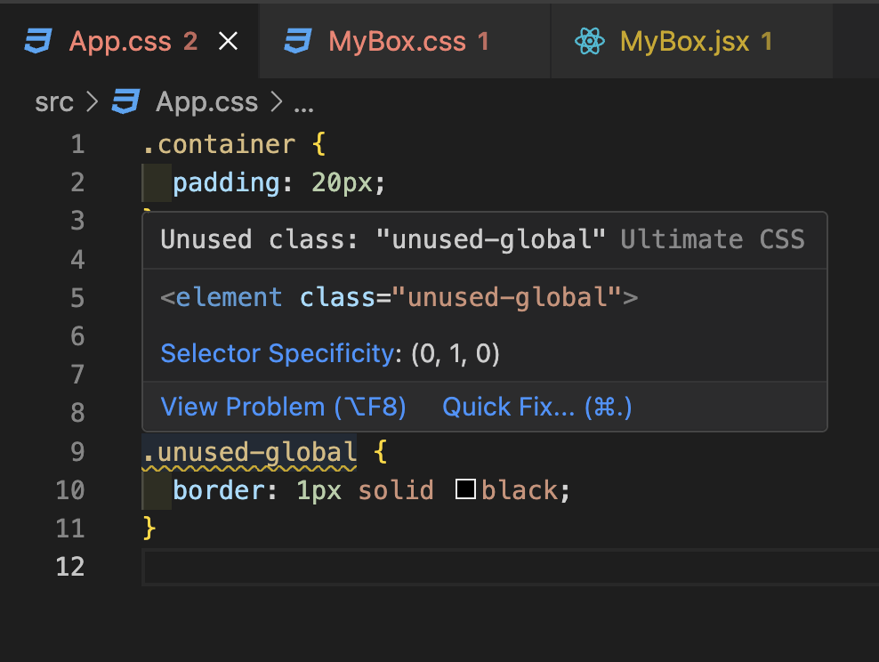
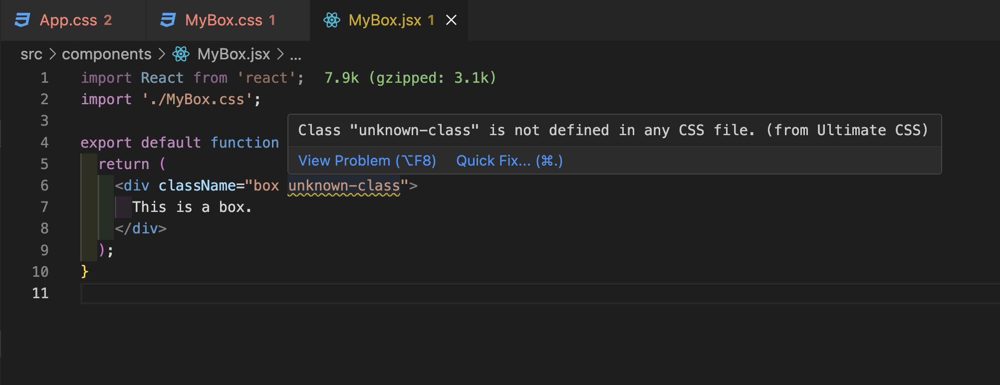

# 🔥 Ultimate CSS

The **Ultimate CSS** extension helps you write cleaner, more efficient styles by identifying:

- ❌ **Duplicate class definitions** — Flags class names that are defined multiple times across your stylesheets.
- ⚠️ **Unused CSS classes** — Warns you about CSS classes that are defined but not used anywhere.
- ⚠️ **Undefined class usage** — Highlights any class used in your HTML/JS/JSX/TS/TSX files that isn’t defined in your CSS.

> ⚠️ **Note:** SCSS support is coming soon! This version focuses on stable and accurate diagnostics for standard CSS files.

---

## ⚙️ Settings

Customize how Ultimate CSS analyzes your project by toggling a few helpful settings in the VSCode Settings UI:

- ✅ **Analyze templates (HTML/JS/TS/JSX/TSX)** – Detects undefined classes in your markup files  
- ✅ **Analyze duplicate CSS classes** – Flags class names that are defined multiple times across stylesheets  
- ✅ **Analyze unused CSS classes** – Warns you about styles that are defined but not used anywhere

> You’ll find these options under **“Ultimate CSS”** in your VSCode Settings panel.

---

## 📸 Screenshots

### ❌ Duplicate Class Detection

### ⚠️ Unused CSS Class

### ⚠️ Undefined Class Usage

---

## ✨ Features

### 🔍 Real-Time Diagnostics
- Underlines issues directly in your code:
  - **Red** for duplicate class definitions
  - **Yellow** for unused or undefined class usage

### 🧠 Project-Wide Analysis
- Scans your **entire workspace** — not just open files
- Keeps diagnostics up-to-date as you code

### 💡 Smart Suggestions *(Coming Soon)*
- Quick fixes for removing unused classes
- Suggestions for renaming or merging duplicates

---

## 🚀 Getting Started

1. Install **Ultimate CSS** from the [VSCode Marketplace](https://marketplace.visualstudio.com/vscode).
2. Open a project with CSS and HTML/JS/TS/JSX/TSX files.
3. Start coding — the extension will automatically highlight issues across your styles.

---

## ⚙️ Extension Commands

| Command | Description |
|--------|-------------|
| `Ultimate CSS: Run Diagnostics` | Manually triggers a full scan of your workspace |

---

## 🛠 Roadmap

- [ ] Reintroduce full SCSS support (with safer parsing)
- [ ] Add quick fixes for unused/duplicate classes
- [ ] Improve performance for large monorepos
- [ ] Configurable ignore rules or `.ultimatecssrc`

---

## 📄 License

This extension is licensed under the [MIT License](./LICENSE).

---

## 💬 Feedback or Ideas?

Have a feature suggestion or bug to report? Visit the [GitHub Repo](https://github.com/JoshAaronLevy/impostercoding) and open an issue. Your feedback helps make this better!
